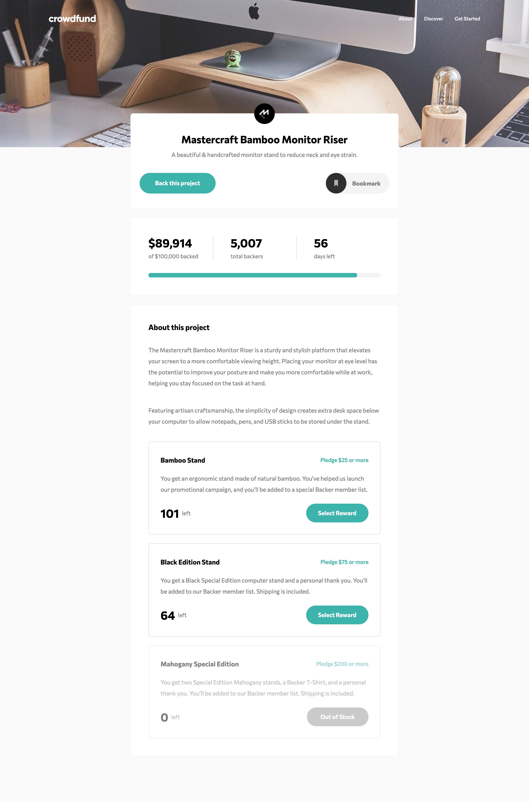

# Crowdfunding product page solution

This is a solution to the [Crowdfunding product page challenge on Frontend Mentor](https://www.frontendmentor.io/challenges/crowdfunding-product-page-7uvcZe7ZR).

 

<!-- ### Primary

- Moderate cyan: hsl(176, 50%, 47%)
- Dark cyan: hsl(176, 72%, 28%)

### Neutral

- Black: hsl(0, 0%, 0%)
- Dark gray: hsl(0, 0%, 48%)

### Body Copy

- Font size: 16px

### Font

- Family: [Commissioner](https://fonts.google.com/specimen/Commissioner)
- Weights: 400, 500, 700 -->
